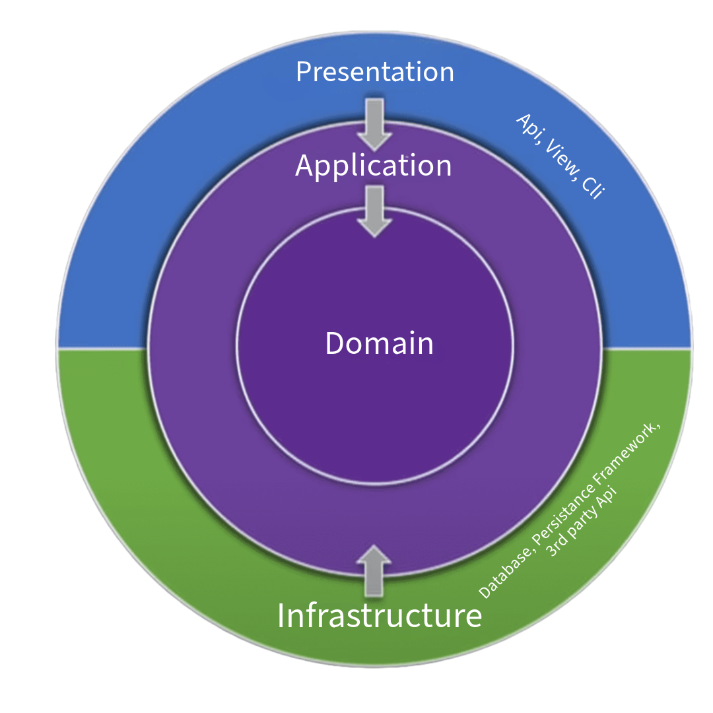
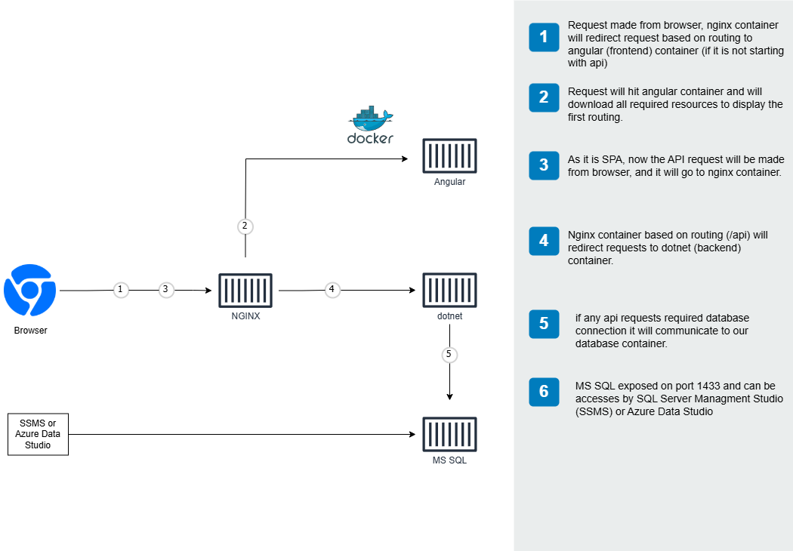

[](https://github.com/nitin27may/clean-architecture-docker-dotnet-angular/actions/workflows/angular-build.yml)
[](https://github.com/nitin27may/clean-architecture-docker-dotnet-angular/actions/workflows/api-build.yml)

# Clean Architecture Full-Stack Starter: .NET, Angular, and PostgreSQL with Docker

## Project Overview
A production-ready boilerplate for building modern web applications using .NET 9 Web API, Angular 19, and PostgreSQL with Docker. This template implements clean architecture principles and includes essential features for enterprise applications.

### Key Technical Features

#### Frontend (Angular 19)
- Modern dependency injection using `inject()` function
- Signal-based state management
- Computed signals for derived state
- Angular Material 19 with theme support
- TailwindCSS v4 for utility-first styling
- JWT-based authentication with auto token refresh
- Route guards with permission-based access control
- Interceptors for JWT and error handling
- Server-Side Rendering (SSR) support

#### Backend (.NET 9)
- Clean Architecture implementation
- Generic Repository and Service patterns
- Dapper with PostgreSQL for efficient data access
- JWT authentication with role-based permissions 
- Middleware for exception handling
- Fluent Validation
- Comprehensive audit logging
- AutoMapper for DTO mapping

#### DevOps & Infrastructure
- Docker support with multi-stage builds
- Docker Compose for local development
- NGINX as load balancer
- PostgreSQL database integration
- Health check endpoints

<hr>

## **Note**
This project is under active development, and we are regularly adding new features, enhancements, and documentation updates. 

Stay tuned and watch this repository for the latest updates! [Roadmap](https://github.com/nitin27may/clean-architecture-docker-dotnet-angular?tab=readme-ov-file#roadmap--upcoming-features)
<hr>

## Clean Architecture Series (Ctrl+Click or Cmd+Click to open in a new tab)

To understand this project in-depth, refer to our detailed series of articles on Clean Architecture. This series explains the architectural decisions, setup processes, and best practices used throughout this project.

1. [Clean Architecture: Introduction to the Project Structure](https://nitinksingh.com/clean-architecture-introduction-to-the-project-structure/) - Overview of architectural layers and their roles
2. [Clean Architecture: Implementing AutoMapper for DTO Mapping with Audit Details](https://nitinksingh.com/implementing-automapper-for-dto-mapping-and-audit-logging/) - Setting up AutoMapper for data transformation and audit trails
3. [Clean Architecture: Validating Inputs with FluentValidation](https://nitinksingh.com/validating-inputs-with-fluent-validation/) - Implementing clean input validation with FluentValidation
4. [Clean Architecture: Dependency Injection Setup Across Layers](https://nitinksingh.com/dependency-injection-setup-across-layers/) - Configuring dependency injection for better modularity
5. [Clean Architecture: Implementing Activity Logging with Custom Attributes](https://nitinksingh.com/implementing-activity-logging-with-custom-attributes/) - Building a custom attribute system for activity tracking
6. [Clean Architecture: Handling Authorization and Role-Based Access Control (RBAC)](https://nitinksingh.com/handling-authorization-and-role-based-access-control-rbac/) - Setting up robust authorization and access control
7. [Clean Architecture: The Unit of Work Pattern and Transaction Management Using Dapper](https://nitinksingh.com/unit-of-work-pattern-and-its-role-in-managing-transactions/) - Implementing reliable transaction management
8. [Clean Architecture: Using Dapper for Data Access with the Repository Pattern](https://nitinksingh.com/using-dapper-for-data-access-and-repository-pattern/) - Implementing efficient data access patterns
9. [Clean Architecture: Best Practices for Creating and Using DTOs in the API](https://nitinksingh.com/best-practices-for-creating-and-using-dtos-in-the-api/) - Designing and implementing effective DTOs
10. [Clean Architecture: Seeding Initial Data Using Docker Compose and SQL Scripts](https://nitinksingh.com/seeding-initial-data-using-docker-compose-and-sql-scripts/) - Setting up automated data seeding
11. [Dockerizing the .NET Core API and MS SQL Server](https://nitinksingh.com/dockerizing-the-net-core-api-and-ms-sql-server/) - Creating a containerized development environment
12. [Error Handling and Exception Management in the API](https://nitinksingh.com/error-handling-and-exception-management-in-the-api/) - Building a robust error handling system

## Features
A complete backend and frontend project structure to build on, with login, user and permission-based role management already integrated
### Core Architecture
- [x] Clean Architecture Design
- [x] Modular Project Structure

### Backend: .NET
- [x] .NET 9
- [x] Dapper Support
- [x] Authentication/Authorization based on OIDC/OAuth2 and ASP.NET Core Identity
- [x] Middleware for Exception Handling
- [x] Role Based API access, Support for Feature and Operation Mapping
- [x] Activity Log (as User's Activity)
- [x] Swagger/OpenAPI Documentation

### Frontend: Angular
- [x] Angular 19
- [x] Tailwind CSS and Angular Material
- [ ] Role based access of pages (Routing) - Coming Soon
- [ ] Role based action (Add, Edit, Delete) on a page (feature) - Coming Soon

### Dockerized Setup
- [x] Docker-Compose for Multi-Container Orchestration with NGINX as Load Balancer
- [ ] Health Checks
- [x] Docker Debug mode with hot reload for the API and UI
- [x] Docker Production version

## Roadmap & Upcoming Features

We have an ambitious roadmap to enhance this project with the following features, organized into development phases:

### Phase 1: Enhanced RBAC & UI Modernization

Focus: Establishing a robust security foundation and creating a polished, modern UI.

#### Role-Based Access Control Refinement
- [ ] Configure distinct roles (Admin, Manager, Editor, Viewer)
- [ ] Implement permission-based policies in backend
- [ ] Create role assignment interface for administrators
- [ ] Apply permission checks in UI components

#### UI Enhancement with Tailwind CSS
- [ ] Implement Tailwind CSS with custom theme
- [ ] Create responsive layouts for all screen sizes
- [ ] Design consistent component library
- [ ] Add visual indicators for permission levels

#### Contact Interface Improvements
- [ ] Redesign contact list with modern data table
- [ ] Create detailed contact profile view
- [ ] Add categorization and organization features
- [ ] Implement advanced filtering and search

### Phase 2: Activity Logging & Admin View

Focus: Implementing comprehensive audit tracking and administrative oversight.

#### Enhanced Activity Logging
- [ ] Extend existing audit logging functionality
- [ ] Capture detailed context for all operations
- [ ] Implement logging categories for better organization
- [ ] Create storage and retrieval optimization

#### Admin Activity Dashboard
- [ ] Design activity overview dashboard
- [ ] Implement filtering and search for logs
- [ ] Create visualization of recent system activity
- [ ] Add export capabilities for compliance purposes

#### Contact-Level Activity Timeline
- [ ] Add activity history to contact profiles
- [ ] Show who changed what and when
- [ ] Implement filtering for contact-specific activities
- [ ] Display visual diff of contact changes

### Phase 3: Application Logs & Monitoring

Focus: System-level logging, monitoring, and diagnostics.

#### System Logging Implementation
- [ ] Create structured logging for application errors
- [ ] Implement performance tracking for critical operations
- [ ] Add security event logging
- [ ] Configure log levels and categories

#### Admin Diagnostics Dashboard
- [ ] Design system health dashboard
- [ ] Create visualizations for error rates and performance
- [ ] Implement log search and filtering
- [ ] Add alert configuration for critical issues

#### Performance Monitoring
- [ ] Add timing metrics for API endpoints
- [ ] Track database query performance
- [ ] Monitor client-side performance
- [ ] Implement threshold alerts

### Phase 4: Real-Time Notifications

Focus: Adding collaborative features with real-time updates.

#### SignalR Integration
- [ ] Implement SignalR hubs for contact updates
- [ ] Create client-side notification service
- [ ] Add connection management and resilience
- [ ] Implement user presence tracking

#### Notification Center
- [ ] Design notification UI component
- [ ] Implement read/unread state management
- [ ] Create notification preferences
- [ ] Add notification history and archiving

#### Browser Push Notifications (Self Hosted or FCM)

- [ ] Implement service worker registration in Angular
- [ ] Set up Web Push API integration in .NET backend
- [ ] Create VAPID key management system
- [ ] Develop notification subscription management
- [ ] Implement notification delivery when browser is closed
- [ ] Add notification interaction handling (clicks/dismissals)
- [ ] Create notification grouping and priority levels

### Phase 5: Social Media Login

Focus: Enhancing authentication with external providers.

#### OAuth Integration
- [ ] Implement Google authentication
- [ ] Add Microsoft authentication option
- [ ] Create secure token exchange
- [ ] Implement proper callback handling

#### Account Linking
- [ ] Design account linking interface
- [ ] Implement identity merging logic
- [ ] Create profile synchronization
- [ ] Add preference for primary login method


### Additional Planned Improvements

#### Moving from MS SQL to PostgreSQL
- [ ] Update the Dapper helper to use PostgreSQL
- [ ] Update existing queries if required

#### DevOps Enhancements
- [ ] CI/CD pipeline improvements
- [ ] Kubernetes deployment support
- [ ] Infrastructure as Code (IaC) templates
- [ ] Automated testing in the pipeline

#### Performance & Reliability
- [ ] Advanced caching strategies
- [ ] Background job processing
- [ ] Health checks and monitoring
- [ ] Rate limiting and API throttling

## Architecture
The project is structured with Clean Architecture principles, separating the solution into distinct layers to ensure scalability, maintainability, and testability. This includes a modular design with API, Application, Domain, and Infrastructure layers.



## Containers


## Quick Start
To quickly start the application, clone the repository and run Docker Compose:

```
git clone https://github.com/nitin27may/clean-architecture-docker-dotnet-angular.git angular-dotnet
cd angular-dotnet 
```
Rename `.env.example` to `.env` :

Shell
```bash
mv .env.example .env
```
Powershell
```powershell
Rename-Item .env.example .env
```
Run below command to run all containers: 
```
docker-compose up
```


**Note** I have used SMTP send function, please update the account details

## Project Folders 
The apps written in the following JavaScript frameworks/libraries:

| folder          | Description                                                                                  |
| --------------- | -------------------------------------------------------------------------------------------- |
| **Frontend (Angular)** | [Angular 19-based front-end application with JWT security.](https://github.com/nitin27may/clean-architecture-docker-dotnet-angular/tree/master/frontend)         |
| **Api (.Net)** | [.NET 9 REST API with Clean Architectuire.](https://github.com/nitin27may/clean-architecture-docker-dotnet-angular/tree/main/backend/src) |

### Built With
#### Angular (19.0.0)

The frontend of this project is developed in Angular. As we are using Server Side Rendering (SSR) we have used Nodejs alpine image in place of other lightweight docker image like nginx to run Angular app.

It contains sample for below (Both UI and API implementation ):

 1. User Registration
 2. Login
 3. Forgot Password
 4. Change Password
 5. Role based API access 
 6. Profile
 7. A complete CRUD example for Contact

Also, it has sample code for Auth guard, services, http interceptors, resolver and JWT implementation

## Frontend Technologies

- **Angular 19**
  - Modern dependency injection with `inject()`
  - Signal-based state management
  - Reactive data flow with computed signals
- **Angular Material 19**
  - Comprehensive Material Design components
  - Theme customization support
  - Built-in dark/light mode with smooth transitions
- **TailwindCSS v4**
  - Utility-first CSS framework
  - Seamless integration with Material theming
  - Responsive design utilities
- **Responsive Layout**
  - Mobile-first approach
  - Flexible grid system
  - Adaptive components

**[Dockerfile for Production](/frontend/Dockerfile)**
**[Dockerfile for Development](/frontend/debug.dockerfile)**

#### Dotnet (9.0.0)

Rest APIs of this project are developed using dotnet

It contains sample for:

1. Middleware implementation for logs
2. JWT implementation for Authorization
3. API routing
4. User registration, login, forgot password, reset password
5. Role based API permission
6. Audit Log
7. Fluent Validation
8. Complete CRUD example for Contact


**[Dockerfile for production](/backend/src/Dockerfile)**
**[Dockerfile for development](/backend/src/Debug.Dockerfile)**


## Getting started

### Using Docker

#### Prerequisite
  
  Install latest [Docker Desktop](https://www.docker.com/products/docker-desktop)


#### Data Seed

 We have added a seed file with data, which will be loaded on docker compose, it has 3 users with different role:
 
 | Username             |  Passsword    |  Role    |
 |----------------------|---------------|----------|
 |nitin27may@gmail.com  | P@ssword#321  | Admin    |
 |editor@gmail.com      | P@ssword#321  | Editor   |
 |reader@gmail.com      | P@ssword#321  | Reader   |

## Feature Request
We welcome suggestions and ideas to improve Clean Architecture Docker .NET Angular! If you have a feature you'd like to see, request from [this link](https://github.com/nitin27may/clean-architecture-docker-dotnet-angular/issues/new?assignees=&labels=&projects=&template=feature_request.md&title= ).

## License
This project is licensed under the MIT License. See the [LICENSE file](LICENSE) for details.

## Contact
For support or questions, please contact Nitin Singh at nitin27may@gmail.com.

